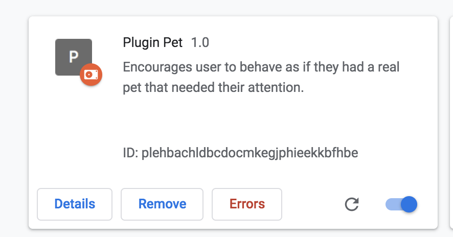
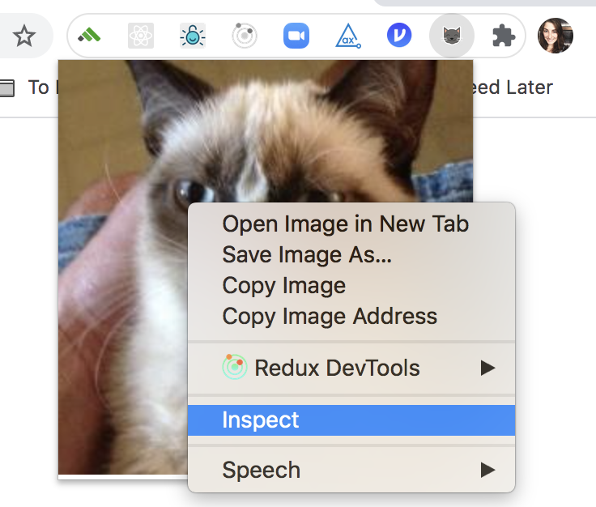

# plugin-pet

To set up you require `yarn` to be installed. If you do not have yarn installed locally, you can get it by running `brew install yarn`.

Pull this branch and run `yarn` to initialize the project and install dependencies.

To test your changes locally, run `yarn build`.

Then, navigate to `chrome://extensions/`, toggle Developer mode to on, and click the `Load unpacked` button.
Then, select the `build` directory. Once you've done this, further changes can be seen by re-running `yarn build` and
clicking the refresh button in the bottom right corner of the Plugin Pet extension card.

When interacting with the plugin, you can access the extension console by right-clicking on the cat's face and clicking `Inspect`

